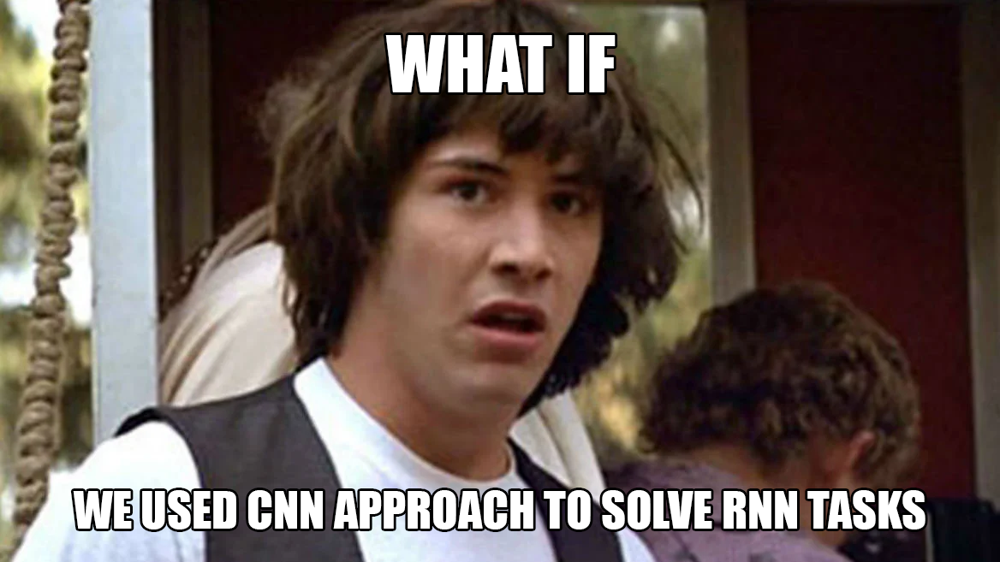
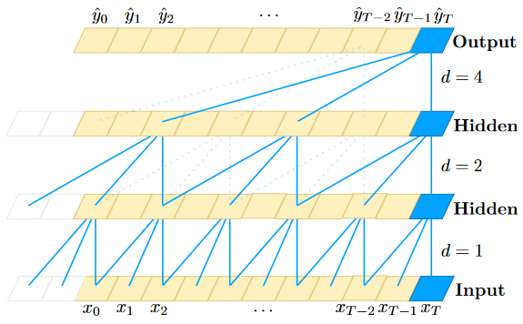
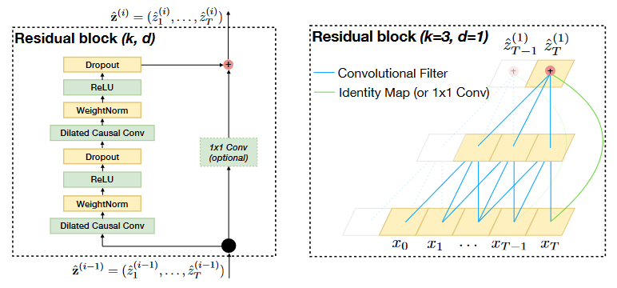
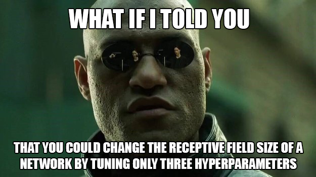
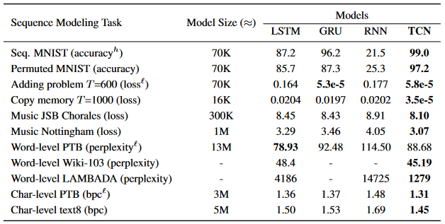
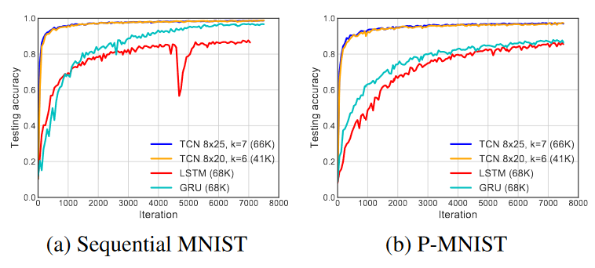
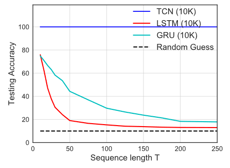

# Модели для последовательностей != рекуррентные сети, или "все гениальное - просто"

Недавно нашел [статью 2018 года](https://arxiv.org/pdf/1803.01271.pdf), в которой авторы поставили себе целью продемонстрировать, что не стоит смотреть на задачи, входы/выходы в которых являют собой последовательности, исключительно сквозь призму рекуррентных сетей, а в результате не только добились своей цели, но еще и улучшили state-of-the-art на модификации небезызвестного MNIST, однако, как водится, обо всем по порядку.

## О чем, собственно, речь?

Авторы статьи, как они сами утверждают, стремятся показать, что для решения задач с последовательными данными в качестве стартовой точки должен рассматриваться именно сверточный, а не рекуррентный поход, и, чтобы доказать свою точку зрения, предлагают общую и вполне прямолинейную модель Temporal Convolutional Network (TCN) и сравнивают ее с рекуррентными решениями на, что называется, "домашнем поле" последних, а именно датасетах, которые часто используются для сравнения качества рекуррентных моделей.

## Да кто такой этот ваш TCN?

Пусть есть вход $(x_0,...,x_T)$, из которого мы получаем элементы по одному, и каждый раз мы хотим получить некоторый выход $\hat{y}_t = f(x_0,...,x_t)$, то есть модель не умеет "заглядывать вперед во времени" и ее очередной выход должен зависеть только от входов, полученных к данному моменту. На уровне идеи модель TCN довольно проста, авторы начинают с операции одномерной расширенной (dilated) свертки:

$$
F(s) = (\mathbf{x} *_d f)(s) = \sum_{i=0}^{k-1} f(i) \cdot \mathbf{x}_{s-d \cdot i}
$$

Ее существенное отличие от привычной операции одномерной свертки состоит в том, что вместо индекса входа $s-i$ берется $s-d \cdot i$, то есть свертка берет предыдущие входы с некоторым "шагом". Параметр $d$ так и называется фактором расширения (dilation factor), а $k$ - это, собственно, размер фильтра.

*Также стоит заметить, что свертка не центрирована, то есть индексы суммы не симметричны относительно нуля. Это вытекает из постановки задачи, которая запрещает нам "заглядывать вперед".*

Благодаря расширенной свертке мы можем увеличить поле восприятия TCN как увеличением $k$, так и увеличением $d$, но дабы мы случайно не "потеряли" какой-нибудь вход рекомендуют экспоненциально увеличивать $d$ от слоя к слою, как, например, на иллюстрации ниже.

Структура самого блока, соединяющего слои сети, вполне проста: берем расширенную свертку, делаем нормализацию весов, применяем нелинейность ReLU и делаем dropout, далее проделываем то же самое еще раз и суммируем с входом блока, прогнанного через фильтр размера 1 на 1. Ниже представлена иллюстрация и пример остаточного блока *(замечание: 1x1 свертка в остаточном слое необходима только в том случае, если вход и выход остаточного блока имеют различные размерности)*.

Выделим ряд преимуществ такой модели перед RNN:

- структура TCN позволяет сразу обучаться на всей последовательности, поскольку блок, который применяется на очередном слое, является общим для всего слоя (в частности, благодаря этому самой модели нужно меньше памяти);
- объем поля восприятия модели (следовательно и объем памяти, необходимый для модели) можно регулировать буквально тремя гиперпараметрами: числом слоев и величинами $d$ и $k$, о которых мы уже поговорили;
- для TCN чужды взрывающиеся/затухающие градиенты, поскольку длина пути обратного распространения ошибки не зависит от длины входной последовательности;

Но стоит отметить, что TCN при генерации предсказания должна хранить в памяти все входные данные, в то время как RNN берет их последовательно и некое обобщение всех предшественников в ней хранится в скрытых векторах фиксированной длины. Также при переносе TCN с одной задачи на схожую, но требующую держать в уме более длинную историю, можно потерпеть неудачу и придется брать новые гиперпараметры.

## Рубрика "эксперименты"

Итак, результаты TCN, с которым мы столько разбирались, сравнили с рекуррентной нейронной сетью (RNN) и ее модификациями: GRU и LSTM. Что же собой представляет "домашнее поле", о котором было сказано в самом начале? Тут и предсказывание следующей ноты в композициях И. С. Баха ([JSB](http://www-ens.iro.umontreal.ca/~boulanni/icml2012)) и произведениях из коллекции [Nottingham Music Database](http://abc.sourceforge.net/NMD/), и предсказывание следующего символа в текстах из датасетов PennTreebank и text8, и "игрушечные" задачи по обнаружению двух помеченных чисел в последовательности и нахождению их суммы (adding problem) и копированию начала последовательности в конец (copy memory), в общем, за описаниями датасетов с постановками задач и кодом моделей отсылаю читателя к [репозиторию](https://github.com/locuslab/TCN). Абсолютно в любом тесте TCN если не демонстрирует значительное превосходство, то хотя бы показывает сопоставимый результат. Ниже в подтверждение представлена таблица с результатами моделей на каждом датасете с указанием метрик, по которым модели сравниваются.

Но чему я удивился больше всего, так это тому, насколько хорошую точность выдал TCN на датасетах Sequential MNIST и Permuted Sequential MNIST при своей простоте! На Permuted Sequential MNIST модель TCN [улучшила state-of-the-art](https://paperswithcode.com/sota/sequential-image-classification-on-sequential), и этот результат был побит только спустя два года (!), а на Sequential MNIST без перестановок он уступил всего 0.2% точности Dilated GRU (опять же, идея с dilation-ом и тут помогла).

*Датасет Sequential MNIST состоит из цифр MNIST, "вытянутых" из матрицы размера 28 на 28 в вектор длины 784, который подается модели на вход как последовательность. Датасет Permuted Sequential MNIST - это фактически Sequential MNIST, к каждому элементу которого применили одну и ту же перестановку (чтобы модели приходилось заучивать больше длинных зависимостей, ведь пиксели, которые раньше стояли рядом или хотя бы в одной строчке, могли оказаться по разные концы последовательности).*

Стоит отметить, что TCN дает своим оппонентам фору и в скорости сходимости, вот, например, как меняется точность TCN, LSTM и GRU на тех же самых Seq. MNIST и Permuted MNIST за 10 эпох.

Также результаты на задании copy memory показывают, что TCN способен запомнить фактически сколь угодно долгую историю, в то время как GRU и LSTM - нет, и с увеличением расстояния, на которое по постановке задачи нужно скопировать начало ввода в конец вывода, они начинают просто гадать.

К чему я все это? Ах да, я хотел поделиться тем, чему меня научила эта статья. К любой задаче можно и нужно искать новые подходы, и рано или поздно это обязательно принесет плоды и найдется простая и гениальная модель, которая превзойдет все предыдущие!

*Пост написан для [курса СПбГУ по машинному обучению](https://github.com/spbu-math-cs/ml-course). Сам я являюсь студентом, поэтому открыт для исправлений, дополнений и обсуждений. В конце концов, век живи - век учись!*
